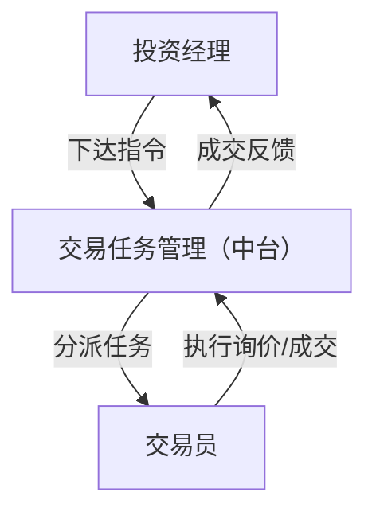
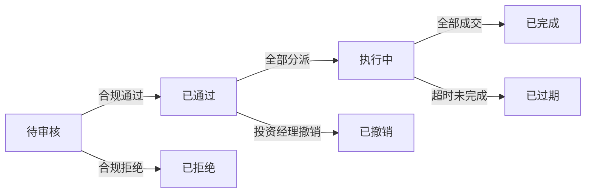
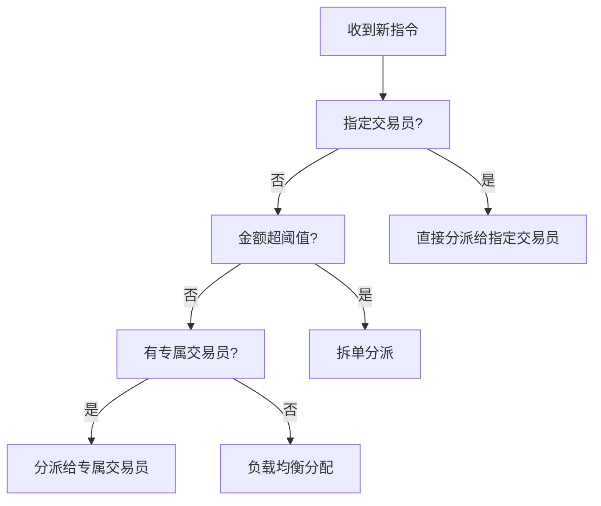
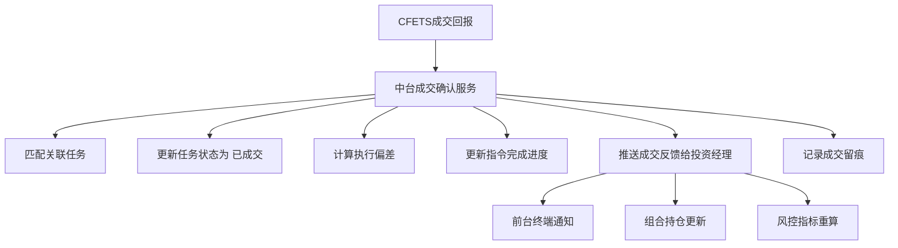

# 交易任务管理

> 最后更新：2026-04-01

## 一、模块定位

交易任务管理是中台的调度中枢，负责承接投资经理的交易意图，将其转化为可执行的交易任务，分派给交易员并跟踪执行全流程。它是连接"投资决策"与"交易执行"的桥梁。

## 二、核心概念模型

### 2.1 指令（Order）

投资经理下达的交易意图，是任务的源头。

| 属性 | 说明 | 示例 |
|------|------|------|
| 指令ID | 系统唯一标识 | ORD-20260401-001 |
| 债券代码 | 交易标的 | 210210.IB |
| 债券名称 | 交易标的名称 | 21国开10 |
| 交易方向 | 买入/卖出 | BUY |
| 指令数量 | 面值金额（万元） | 5000 |
| 价格区间 | 收益率或净价范围 | 2.80%~2.85% |
| 指令类型 | 限价/市价/策略 | 限价指令 |
| 紧迫度 | 普通/优先/紧急 | 紧急 |
| 投资经理 | 下达人 | PM-张三 |
| 组合 | 所属投资组合 | 固收增强组合A |
| 下达时间 | 创建时间戳 | 2026-04-01 09:30:00 |
| 有效期 | 截止时间 | 当日有效 |

### 2.2 任务（Task）

由指令拆分或转化而来的交易员执行单元。一条指令可拆分为多个任务，分给不同交易员并行执行。

| 属性 | 说明 | 示例 |
|------|------|------|
| 任务ID | 系统唯一标识 | TASK-20260401-001 |
| 关联指令 | 来源指令ID | ORD-20260401-001 |
| 执行交易员 | 分派的交易员 | Trader-李四 |
| 分配数量 | 本次任务面值 | 3000万 |
| 价格区间 | 继承或缩窄自指令 | 2.80%~2.83% |
| 执行路径 | 直接/经纪商/X-Bond | 直接交易 |
| 任务状态 | 见状态机 | 执行中 |
| 创建时间 | 任务生成时间 | 2026-04-01 09:31:00 |

### 2.3 成交反馈（Fill）

交易员执行完毕后的成交结果回传。

| 属性 | 说明 | 示例 |
|------|------|------|
| 成交ID | 系统唯一标识 | FILL-20260401-001 |
| 关联任务 | 来源任务ID | TASK-20260401-001 |
| 成交价格 | 实际成交收益率 | 2.82% |
| 成交数量 | 实际成交面值 | 3000万 |
| 对手方 | 交易对手机构 | XX银行 |
| 成交时间 | CFETS成交通知时间 | 2026-04-01 09:45:00 |
| 成交路径 | 直接/经纪商/X-Bond | 直接交易 |
| CFETS成交单号 | 外部系统关联 | CFETS-20260401-12345 |

## 三、指令生命周期

### 状态说明

| 状态 | 触发条件 | 可流转至 | 说明 |
|------|---------|---------|------|
| 待审核 | 投资经理下达指令 | 已通过/已拒绝 | 合规检查（投资范围、额度、集中度） |
| 已通过 | 合规校验通过 | 执行中/已撤销 | 等待任务分派 |
| 已拒绝 | 合规校验不通过 | 终态 | 退回投资经理并说明原因 |
| 执行中 | 至少一个任务已分派 | 已完成/已过期 | 交易员正在执行 |
| 已完成 | 所有任务均已成交 | 终态 | 成交反馈已回传 |
| 已撤销 | 投资经理主动撤销 | 终态 | 仅未成交部分可撤销 |
| 已过期 | 超过有效期 | 终态 | 未成交部分自动失效 |

## 四、任务分派策略

### 4.1 分派模式

| 模式 | 说明 | 适用场景 |
|------|------|---------|
| 指定分派 | 投资经理指定交易员 | 特定对手方关系、特定券种专长 |
| 自动分派 | 按规则自动匹配交易员 | 批量指令、常规交易 |
| 抢单模式 | 任务进入公共池，交易员自行认领 | 紧急任务、策略性指令 |
| 拆单分派 | 大额指令拆分给多个交易员 | 大额交易、分散执行 |

### 4.2 自动分派规则

### 4.3 任务优先级

| 优先级 | 定义 | 调度策略 |
|--------|------|---------|
| P0-紧急 | 止损、临近到期、监管要求 | 立即推送，打断式提醒 |
| P1-优先 | 投资经理标记优先、大额指令 | 优先排队，顶部展示 |
| P2-普通 | 日常交易指令 | 按时间顺序排队 |
| P3-低优 | 探询性指令、长期限指令 | 空闲时处理 |

## 五、执行跟踪

### 5.1 任务执行状态

### 5.2 执行里程碑

| 里程碑 | 时间记录 | 说明 |
|--------|---------|------|
| 任务创建 | 任务生成时间 | 从指令拆分或转化 |
| 交易员接手 | 交易员确认时间 | 交易员开始处理 |
| 首次询价 | 第一次发出询价时间 | 标志执行开始 |
| 意向达成 | IM沟通达成意向时间 | 价格和数量初步确定 |
| CFETS录入 | CFETS对话报价时间 | 进入正式成交流程 |
| 成交确认 | CFETS成交通知时间 | 交易正式达成 |
| 反馈回传 | 投资经理收到反馈时间 | 闭环完成 |

### 5.3 执行监控看板

> 中台向前台终端推送的实时数据视图。

| 维度 | 指标 | 说明 |
|------|------|------|
| 任务概览 | 待执行/执行中/已完成数量 | 按交易员、按指令分组统计 |
| 时效监控 | 平均执行耗时 | 从任务创建到成交确认的时间 |
| 执行率 | 成交量/指令量 | 衡量任务完成质量 |
| 价格偏差 | 成交价 vs 指令目标价 | 衡量执行质量 |
| 超时预警 | 超过阈值的未完成任务 | 触发升级提醒 |

## 六、成交反馈闭环

### 6.1 反馈流程

### 6.2 部分成交处理

| 场景 | 处理策略 |
|------|---------|
| 单任务部分成交 | 任务状态标记为"部分成交"，剩余数量继续执行 |
| 多任务部分成交 | 按任务优先级依次扣减，更新各任务完成比例 |
| 指令总量未满 | 自动生成补充任务或提示投资经理决策 |

### 6.3 异常处理

| 异常场景 | 处理策略 |
|---------|---------|
| 成交无法匹配任务 | 进入"待认领"状态，人工关联 |
| 成交价格超出指令范围 | 标记为"偏离成交"，触发合规提醒 |
| 对手方违约 | 任务状态回退，重新进入询价 |
| CFETS系统故障 | 保留本地成交记录，故障恢复后同步 |

## 七、与其他模块的接口

### 7.1 对外提供的接口

| 接口 | 消费方 | 说明 |
|------|--------|------|
| 创建指令 | 前台终端（投资经理） | 投资经理下达交易指令 |
| 查询指令状态 | 前台终端 | 指令执行进度查询 |
| 查询任务列表 | 前台终端（交易员） | 交易员查看待执行任务 |
| 更新任务状态 | 询报价交易模块 | 交易执行进度回调 |
| 成交反馈推送 | 前台终端 / 内部系统 | 成交结果实时推送 |
| 任务统计查询 | 前台终端 | 执行效率与质量统计 |

### 7.2 依赖的外部接口

| 接口 | 提供方 | 说明 |
|------|--------|------|
| 合规检查 | 中台公共服务层 | 指令下达前的合规校验 |
| CFETS成交回报 | CFETS | 成交确认与回传 |
| 对手方授信 | 中台公共服务层 | 交易前对手方额度检查 |
| 行情基准价 | 交易行情模块 | 评估执行价格合理性 |
