# 交易流程

> 最后更新：2026-03-30

## 一、交易流程总览

> 现券买卖是银行间债券市场最主要的交易类型，完整流程涵盖：**行情查看 → 询价谈判 → 下单成交 → 成交回执 → 交易确认 → 清算结算** 六大环节。

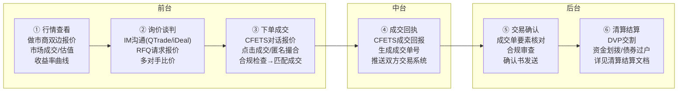

## 二、核心用户角色

> 系统的主要使用者是固收业务的投资经理和交易员，两者职责明确、协作紧密。

### 角色分工

| 维度       | 投资经理（PM）                | 交易员（Trader）                  |
| -------- | ----------------------- | ---------------------------- |
| **核心职责** | 制定投资策略、组合管理             | 执行交易指令、询价谈判                  |
| **日常工作** | 研判市场走势、决定买卖方向和仓位        | 根据指令询价、寻找对手、执行交易             |
| **关注重点** | 组合收益、久期、利差、信用风险         | 成交效率、执行价格、对手方关系              |
| **系统操作** | 下达/修改/撤销交易指令、查看组合持仓     | 接收指令→询价→下单→反馈成交              |
| **决策权限** | 决定"买什么、买多少、什么价位区间"      | 决定"找谁买、以什么具体价格成交"            |
| **风控视角** | 组合层面风险限额、合规约束           | 单笔交易合规检查、对手授信                |
| **行情分析** | 收益率曲线、估值、信用利差、市场成交分布    | 做市商双边报价（Bid/Ask）、盘口深度、最新成交价量 |
| **分析输出** | 交易指令（债券/方向/数量/价格区间/紧迫度） | 执行策略（找谁询价、何时出手、分拆还是一次性）      |

### 投资经理→交易员协作流程

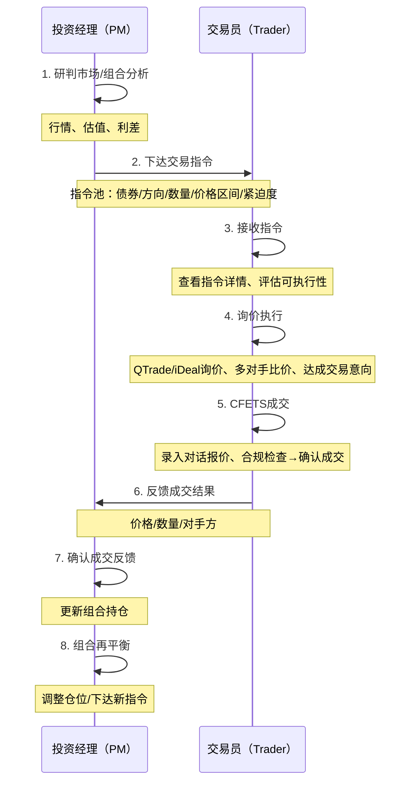

### 当前终端入口映射

| 角色   | 主要入口               | 对应白皮书模块                     | 典型动作                   |
| ---- | ------------------ | --------------------------- | ---------------------- |
| 投资经理 | 行情系统（MS）+ 分析系统（AS） | 债券综合屏、利率/信用/市场分析、预警、自选      | 看公共行情、做判断、下任务、跟踪结果     |
| 交易员  | 债券工作台              | 我的任务、我的行情、议价和发起成交、群发功能、单据管理 | 承接任务、沉淀私域行情、议价、发单、回溯聊天 |

## 三、交易环节详解

### 环节1：行情查看与分析

> 投资经理和交易员在行情查看阶段各有侧重：投资经理从组合视角决策"要不要交易"，交易员从市场微观结构判断"能不能成交"。

**系统功能需求**：

- 实时行情展示（做市商报价、成交行情）
- 收益率曲线展示与分析
- 债券估值查询（中债估值）
- 自选债券列表管理
- 支持从行情分析结果直接生成候选交易指令或加入观察列表

### 环节2：询价与报价（核心环节）

> 银行间债券市场是典型的OTC市场，交易高度依赖询报价环节。
> 据估计，约80%以上的现券交易始于IM沟通（QTrade/iDeal/企微等），最终在CFETS本币系统完成成交。

**当前产品中的工作台闭环**：

- 聊天或任务驱动的交易需求先进入“我的任务”或“我的行情”
- NLP 自动识别债券、方向、价格、数量等关键要素，沉淀为结构化私域行情
- 交易员在工作台内继续议价、群发或发起成交，并保留聊天回溯链路
- 议价达成后生成待确认单据，再与下游交易系统衔接

#### 2.1 询报价体系

> 银行间债券市场是典型的OTC市场，约80%以上的现券交易始于IM沟通（QTrade/iDeal），最终在CFETS本币系统完成成交。

| 交易路径     | 交易机制        | 匿名性  | 适用场景          |
| -------- | ----------- | ---- | ------------- |
| 直接交易     | 一对一询价谈判     | 双方已知 | 大额、非标券、需要谈判   |
| 做市商交易    | 点击成交做市商双边报价 | 双方已知 | 标准券、快速成交      |
| 经纪商交易    | 经纪商居间撮合     | 匿名   | 大额、不想暴露身份     |
| X-Bond交易 | 电子匿名撮合      | 完全匿名 | 现券买卖、流动性好的利率债 |
| X-Repo交易 | 电子匿名撮合      | 完全匿名 | 质押式回购、资金交易    |

##### 直接交易

> 交易员通过IM工具（QTrade/iDeal）直接与对手方询价，达成意向后在CFETS通过对话报价完成成交。

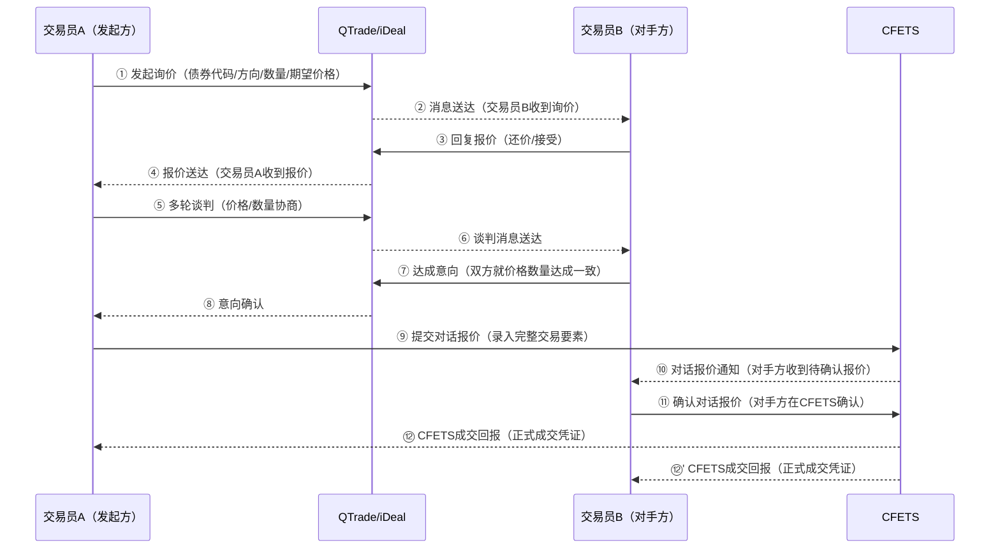

##### 做市商交易

> 做市商在CFETS上持续发布双边报价（Bid/Ask），交易员可直接点击做市商报价完成成交，无需谈判。

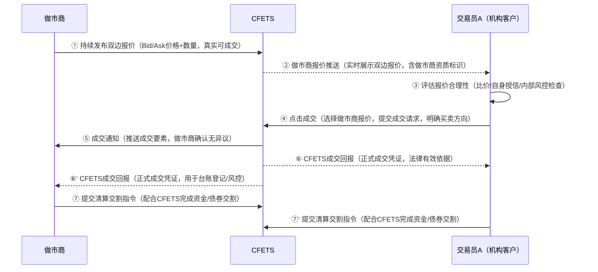

##### 经纪商交易

> 通过货币经纪商撮合成交，交易双方互不知晓对方身份。

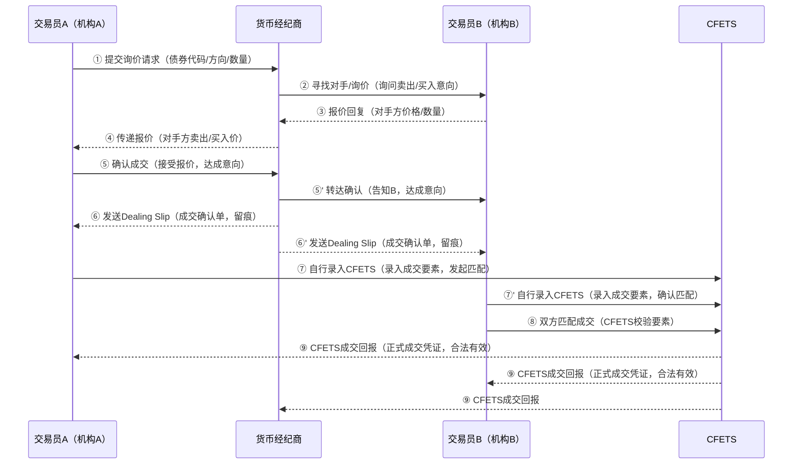

##### X-Bond交易

> 通过CFETS X-Bond电子平台进行匿名撮合成交，适合标准化、流动性较好的现券买卖。

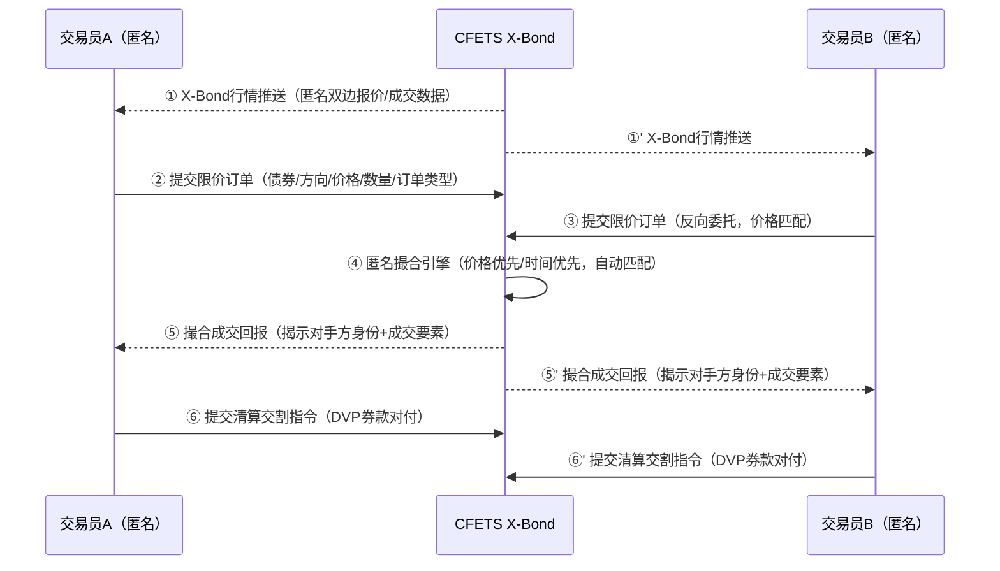

##### X-Repo交易

> 通过CFETS X-Repo电子平台进行质押式回购的匿名撮合成交，支持自动选券和质押率管理。

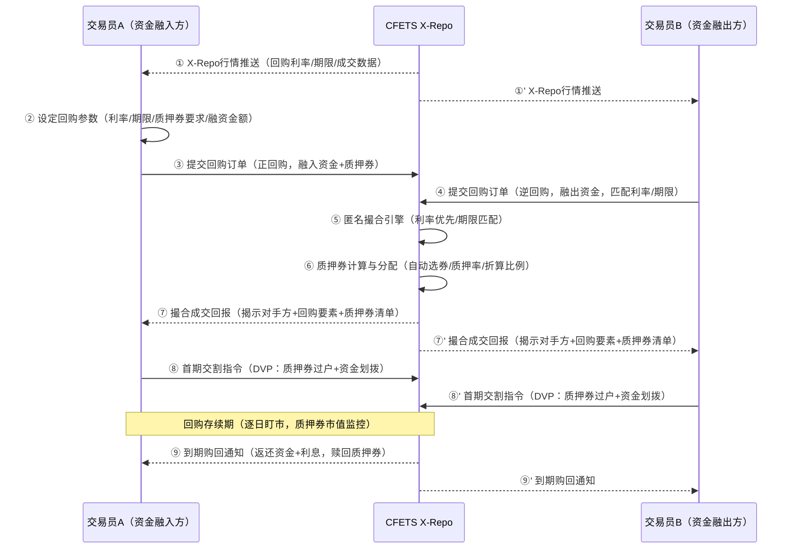

**交易要素**：

| 要素   | 现券买卖    | 质押式回购    | 债券借贷    |
| ---- | ------- | -------- | ------- |
| 债券代码 | ✅       | ✅（质押券）   | ✅（标的券）  |
| 交易方向 | 买入/卖出   | 正/逆回购    | 借入/借出   |
| 价格   | 净价或收益率  | 回购利率(%)  | 借贷费率(%) |
| 数量   | 面值金额    | 融资金额     | 标的券面值   |
| 结算日  | T+0/T+1 | 首次/到期结算日 | 起息/到期日  |
| 结算方式 | DVP     | DVP      | 券券交割    |
| 质押品  | —       | 质押券列表    | 质押券(可选) |

#### 2.2 iDeal在询报价中的角色

CFETS iDeal是交易中心推出的官方合规IM工具，深度集成CFETS交易系统：

- **实名认证**：所有用户经CFETS实名认证，与机构交易员身份绑定
- **合规留痕**：所有沟通信息自动留痕，满足监管审计要求
- **交易辅助**：支持从IM沟通直接发起对话报价/RFQ，无需切换系统
- **做市报价推送**：做市商报价实时推送至IM窗口
- **一级分销**：支持iDeal分销功能，债券承销分销全流程线上化
- **与QTrade竞争**：2021年交易商协会规范IM工具后，iDeal与QTrade形成双寡头格局

### 环节3：下单与成交

**合规检查（交易前）**：

- 交易对手授信额度检查
- 投资范围检查
- 集中度限制检查
- 停牌/发行限制检查
- 交易权限检查

**系统功能需求**：

- 交易要素录入与校验
- 交易前合规检查引擎
- 价格/利率合理性校验
- 交易确认与成交回报
- 成交通知推送

### 环节4：交易确认

**交易确认流程**：

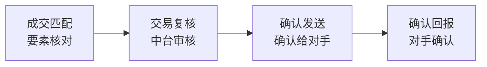

**系统功能需求**：

- 成交单生成与管理
- 交易复核工作流
- 交易确认书生成与发送
- 确认状态跟踪
- 异常交易处理

### 环节5：清算结算

详见 [清算结算](./清算结算.md) 文档。

## 四、交易时间

| 时段    | 时间            | 说明        |
| ----- | ------------- | --------- |
| 开盘前   | 8:30 - 9:00   | 系统准备，查询行情 |
| 上午交易  | 9:00 - 12:00  | 主要交易时段    |
| 午间    | 12:00 - 13:30 | 休市        |
| 下午交易  | 13:30 - 16:30 | 主要交易时段    |
| 交易后处理 | 16:30 - 17:00 | 结算指令发送    |
| 夜间    | 17:00 之后      | 部分品种可延长交易 |

> **注意**：具体交易时间以 CFETS 公告为准，节假日安排另行通知。

## 五、交易执行状态机

> 所有交易路径最终都需经过CFETS完成成交确认。CFETS是银行间债券市场的法定交易平台，成交回报是交易达成的法定依据。

### 5.1 CFETS交互全景

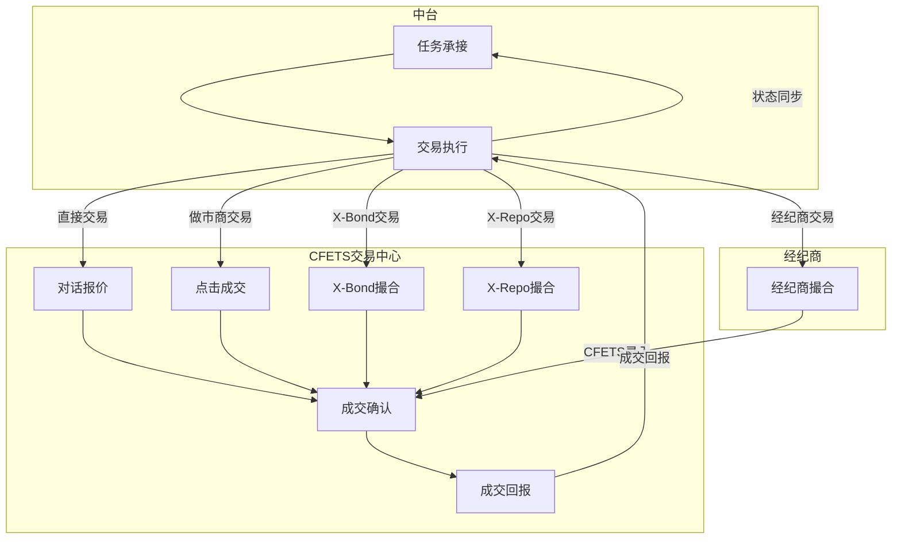

### 5.2 直接交易状态机

> 双方在IM上谈判达成意向后，一方在CFETS提交对话报价，对手方在CFETS上确认或拒绝。

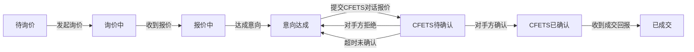

### 5.3 经纪商交易状态机

> 通过经纪商居间撮合，经纪商确认成交后代为在CFETS录入，双方无需互相确认。

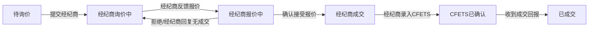

### 5.4 电子交易状态机（做市商/X-Bond/X-Repo）

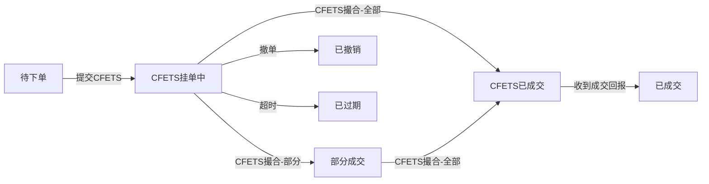

### 5.5 状态说明

**直接交易状态**：

| 状态       | 说明                    | CFETS交互 |
| -------- | --------------------- | ------- |
| 待询价      | 任务已分派，交易员准备开始询价       | —       |
| 询价中      | 交易员通过IM与对手方接触询价       | —       |
| 报价中      | 收到对手方报价，正在谈判          | —       |
| 意向达成     | 双方在IM上就价格数量达成一致       | —       |
| CFETS待确认 | 已在CFETS提交对话报价，等待对手方确认 | 对话报价已提交 |
| CFETS已确认 | 对手方在CFETS确认了对话报价      | 对话报价已确认 |
| 已成交      | 收到CFETS成交回报，交易正式达成    | 收到成交回报  |

**经纪商交易状态**：

| 状态       | 说明                   | CFETS交互    |
| -------- | -------------------- | ---------- |
| 待询价      | 任务已分派，交易员准备向经纪商询价    | —          |
| 经纪商询价中   | 已向经纪商提交询价请求，等待反馈     | —          |
| 经纪商报价中   | 经纪商反馈了报价，交易员评估中      | —          |
| 经纪商成交    | 交易员确认接受经纪商报价，经纪商撮合成功 | —          |
| CFETS已确认 | 经纪商代为在CFETS录入成交      | 成交已录入CFETS |
| 已成交      | 收到CFETS成交回报，交易正式达成   | 收到成交回报     |

**电子交易状态**：

| 状态       | 说明                  | CFETS交互    |
| -------- | ------------------- | ---------- |
| 待下单      | 任务已分派，交易员准备下单       | —          |
| CFETS挂单中 | 订单已提交到CFETS电子平台等待撮合 | 订单已提交CFETS |
| 部分成交     | CFETS已部分撮合成交        | 收到部分成交回报   |
| CFETS已成交 | CFETS已全部撮合成交        | 撮合完成       |
| 已成交      | 收到CFETS成交回报，交易正式达成  | 收到成交回报     |
| 已撤销      | 交易员向CFETS撤单成功       | 撤单请求成功     |
| 已过期      | 订单在CFETS超过有效期未成交    | 订单有效期截止    |

## 六、对手方管理

### 6.1 对手方画像

| 属性    | 说明           | 示例                   |
| ----- | ------------ | -------------------- |
| 对手方ID | 唯一标识         | CP-001               |
| 机构名称  | 对手方全称        | XX银行股份有限公司           |
| 机构类型  | 银行/券商/基金/保险等 | 银行                   |
| 授信额度  | 可用交易额度       | 10亿                  |
| 交易偏好  | 偏好券种、期限、规模   | 利率债、3-5年期            |
| 活跃度   | 历史交易频率       | 高                    |
| 信用等级  | 内部评级         | AAA                  |
| 是否做市商 | 是否具有做市商资格    | 是                    |
| 联系方式  | 交易员姓名、IM账号   | 张三，zhang.san@qtrade |

### 6.2 对手方评级

| 评级 | 标准                   | 交易策略         |
| -- | -------------------- | ------------ |
| A+ | 信用AAA、授信充足、交易活跃、报价合理 | 优先选择，可做大额交易  |
| A  | 信用AA+、授信充足、交易较活跃     | 常规选择，控制交易规模  |
| B  | 信用AA、授信有限、交易偶发       | 谨慎选择，小额尝试    |
| C  | 信用低于AA、授信不足、交易稀少     | 避免选择，或仅做小额隔夜 |

## 七、询价管理

### 7.1 询价模板

| 模板类型  | 适用场景  | 内容示例                                     |
| ----- | ----- | ---------------------------------------- |
| 标准询价  | 常规交易  | "21国开10 买入 5000万 收益率2.80%左右"             |
| 批量询价  | 多个券种  | "21国开10/21国债03 买入 各3000万 收益率2.80%/2.75%" |
| 试探性询价 | 市场摸底  | "21国开10 意向买入 1亿 收益率区间2.75%-2.85%"        |
| 紧急询价  | 止损/限时 | "21国开10 卖出 5000万 立即 收益率2.90%以下"          |

### 7.2 询价策略

| 策略   | 说明         | 适用场景         |
| ---- | ---------- | ------------ |
| 单点询价 | 只向单个对手方询价  | 特定关系、特定券种    |
| 多点并行 | 同时向多个对手方询价 | 市场深度不足、价格不透明 |
| 阶梯询价 | 按价格阶梯逐步询价  | 大额交易、价格敏感    |
| 定向询价 | 针对特定做市商询价  | 活跃券、标准化产品    |

## 八、成交管理

### 8.1 成交要素

| 要素   | 说明                       | 示例                  |
| ---- | ------------------------ | ------------------- |
| 成交ID | 系统唯一标识                   | DEAL-20260401-001   |
| 债券代码 | 交易标的                     | 210210.IB           |
| 交易方向 | 买入/卖出                    | BUY                 |
| 成交价格 | 实际成交收益率                  | 2.82%               |
| 成交数量 | 实际成交面值（万元）               | 5000                |
| 对手方  | 交易对手                     | XX银行                |
| 成交时间 | CFETS确认时间                | 2026-04-01 09:45:00 |
| 成交路径 | 直接/做市商/经纪商/X-Bond/X-Repo | 直接交易                |
| 交易员  | 执行交易员                    | Trader-李四           |
| 关联任务 | 来源任务ID                   | TASK-20260401-001   |

### 8.2 成交确认流程

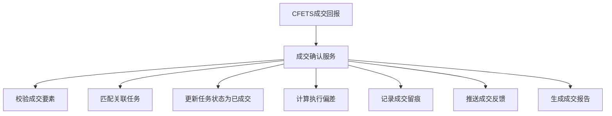

### 8.3 异常成交处理

| 异常类型  | 处理策略               |
| ----- | ------------------ |
| 价格异常  | 标记为偏离成交，触发合规审核     |
| 数量不符  | 按实际成交数量更新，剩余数量继续执行 |
| 对手方违约 | 状态回退至询价中，重新寻找对手    |
| 系统故障  | 保留本地成交记录，故障恢复后同步   |

