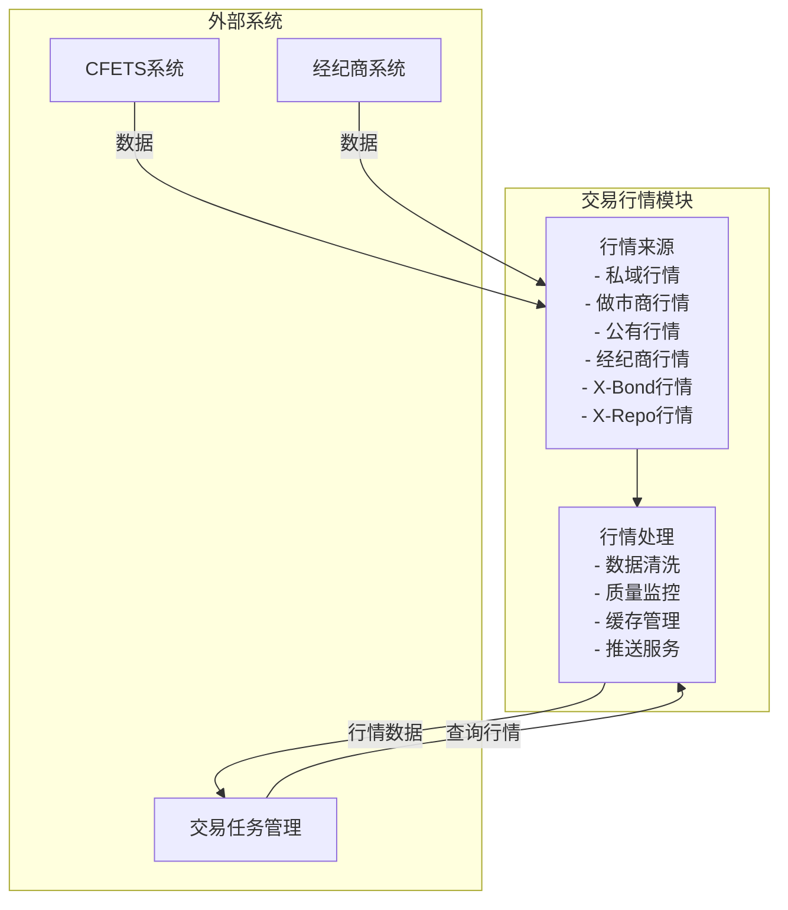
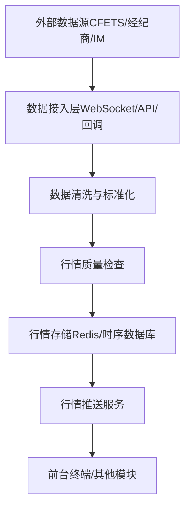

# 交易行情

> 最后更新：2026-04-01

## 一、模块定位

交易行情是中台的价格基准中心，负责汇聚和管理多源行情数据，为交易决策和询报价执行提供统一的价格参考。它覆盖银行间债券市场的主要行情来源，包括私域行情、做市商行情、公有行情、经纪商行情、X-Bond行情和X-Repo行情。

## 二、六类行情来源

### 2.1 私域行情

> 来自IM聊天、内部报价等非公开渠道的行情数据，是机构内部的价格信息。

**数据来源**：
- QTrade/iDeal聊天记录中的报价和意向
- 内部交易员之间的报价沟通
- 机构内部的做市报价
- 一级市场分销报价

**核心功能**：
- **AI语义识别**：从非结构化聊天中提取债券代码、价格、数量、方向等要素
- **意向报价管理**：结构化存储和管理交易意向
- **内部报价发布**：支持交易员发布内部报价
- **报价有效期管理**：跟踪报价的时效性
- **私域行情聚合**：将分散的内部报价整合为统一视图

**技术实现**：
- 对接QTrade/iDeal的消息回调接口
- 部署NLP模型进行语义识别
- 建立私域行情数据库

### 2.2 做市商行情

> 做市商在CFETS上持续发布的双边报价（Bid/Ask），是市场最重要的流动性来源和价格基准。

**数据来源**：
- 做市商双边报价（Bid/Ask）
- 做市商报价响应速度
- 做市商成交量统计
- 做市商报价价差

**核心功能**：
- **双边报价展示**：实时展示做市商的买入价和卖出价
- **报价筛选**：按债券代码、做市商、价差等条件筛选最优报价
- **做市商评价**：统计做市商的报价质量、响应速度、成交量
- **价差分析**：分析做市商报价价差趋势

**技术实现**：
- 订阅CFETS做市商报价推送
- 建立做市商报价质量评估模型
- 与做市商交易模块集成

### 2.3 公有行情

> 来自CFETS等公共平台的标准化行情数据，是市场的公开价格信息。

**数据来源**：
- CFETS成交行情
- 最优报价（Best Bid/Ask）
- 市场深度（Order Book）
- 收益率曲线
- 债券估值（中债估值、上清所估值）

**核心功能**：
- **行情订阅**：实时接收CFETS行情推送
- **成交行情记录**：记录市场成交数据
- **最优报价计算**：实时计算市场最优买卖价
- **市场深度分析**：展示多档报价深度
- **估值查询**：提供债券估值数据

**技术实现**：
- 对接CFETS行情接口（WebSocket/UDP组播）
- 部署实时行情处理引擎
- 建立行情缓存和存储系统

### 2.4 经纪商行情

> 来自货币经纪商的报价和成交数据，反映经纪商撮合市场的价格信息。

**数据来源**：
- 国利经纪商报价
- 国际经纪商报价
- 平安利顺经纪商报价
- 其他经纪商报价
- 经纪商成交数据

**核心功能**：
- **经纪商接口管理**：对接多家经纪商的行情接口
- **报价聚合**：汇总多家经纪商的报价
- **比价分析**：对不同经纪商的报价进行对比分析
- **成交数据记录**：记录经纪商撮合的成交数据
- **佣金管理**：与经纪商佣金数据关联

**技术实现**：
- 对接各经纪商的标准API接口
- 部署经纪商行情聚合系统
- 建立经纪商行情数据库

### 2.5 X-Bond行情

> 来自CFETS X-Bond电子平台的匿名报价和成交数据，反映匿名市场的价格发现。

**数据来源**：
- X-Bond匿名报价
- X-Bond成交行情
- X-Bond市场深度
- X-Bond成交历史

**核心功能**：
- **X-Bond行情订阅**：实时接收X-Bond平台的行情数据
- **匿名报价管理**：存储和展示X-Bond匿名报价
- **成交数据记录**：记录X-Bond平台的成交数据
- **市场深度展示**：展示X-Bond的多档报价深度
- **成交历史分析**：分析X-Bond的历史成交情况

**技术实现**：
- 对接CFETS X-Bond接口
- 部署X-Bond行情处理引擎
- 与X-Bond交易模块集成

### 2.6 X-Repo行情

> 来自CFETS X-Repo平台的回购利率和成交数据，反映质押式回购市场的资金价格。

**数据来源**：
- X-Repo回购利率报价
- X-Repo成交行情
- X-Repo期限结构（隔夜/7天/14天/1M等）
- X-Repo质押券要求
- 回购利率曲线

**核心功能**：
- **X-Repo行情订阅**：实时接收X-Repo平台的利率报价
- **回购利率展示**：按期限展示回购利率
- **质押券行情**：展示不同质押券种的利率差异
- **期限结构分析**：分析回购利率的期限结构
- **利率趋势分析**：跟踪回购利率的日内和日间趋势

**技术实现**：
- 对接CFETS X-Repo接口
- 建立回购利率期限结构模型
- 与X-Repo交易模块集成

## 三、行情数据模型

### 3.1 通用行情结构

| 字段 | 说明 | 示例 |
|------|------|------|
| 行情ID | 系统唯一标识 | QUOTE-20260401-001 |
| 债券代码 | 交易标的 | 210210.IB |
| 债券名称 | 交易标的名称 | 21国开10 |
| 报价类型 | 做市/意向/成交 | 做市报价 |
| 买卖方向 | 买入/卖出 | 买入 |
| 报价价格 | 收益率或净价 | 2.82% |
| 报价数量 | 可成交数量（万元） | 5000 |
| 报价方 | 报价机构/交易员 | XX银行 |
| 报价时间 | 报价生成时间 | 2026-04-01 09:30:00 |
| 有效期 | 报价有效时间 | 10分钟 |
| 行情来源 | 私域/做市商/公有/经纪商/X-Bond/X-Repo | 公有行情 |
| 状态 | 有效/过期/撤回 | 有效 |

### 3.2 成交行情结构

| 字段 | 说明 | 示例 |
|------|------|------|
| 成交ID | 系统唯一标识 | TRADE-20260401-001 |
| 债券代码 | 交易标的 | 210210.IB |
| 债券名称 | 交易标的名称 | 21国开10 |
| 交易方向 | 买入/卖出 | 买入 |
| 成交价格 | 实际成交收益率 | 2.82% |
| 成交数量 | 实际成交面值（万元） | 5000 |
| 买方 | 买入机构 | XX基金 |
| 卖方 | 卖出机构 | XX银行 |
| 成交时间 | 成交确认时间 | 2026-04-01 09:45:00 |
| 成交来源 | 直接/经纪商/X-Bond | 直接交易 |
| 成交单号 | 外部系统成交编号 | CFETS-20260401-12345 |

### 3.3 市场深度结构

| 字段 | 说明 | 示例 |
|------|------|------|
| 债券代码 | 交易标的 | 210210.IB |
| 买入档位 | 买1/买2/买3 | 买1 |
| 买入价格 | 该档位买入价格 | 2.81% |
| 买入数量 | 该档位买入数量 | 3000万 |
| 卖出档位 | 卖1/卖2/卖3 | 卖1 |
| 卖出价格 | 该档位卖出价格 | 2.83% |
| 卖出数量 | 该档位卖出数量 | 4000万 |
| 时间戳 | 深度数据生成时间 | 2026-04-01 09:30:00 |
| 来源 | 公有/X-Bond | 公有行情 |

## 四、行情处理流程

### 4.1 数据接入流程

### 4.2 行情质量控制

| 检查项 | 检查规则 | 处理策略 |
|--------|---------|---------|
| 价格合理性 | 偏离估值±100bp | 标记为异常，不参与最优价计算 |
| 数据完整性 | 缺失关键字段 | 丢弃或补全后标记为可疑 |
| 时效性 | 超过有效期 | 标记为过期，从活跃行情中移除 |
| 一致性 | 同一来源数据矛盾 | 以最新数据为准，记录冲突 |
| 重复数据 | 重复的报价/成交 | 去重，保留最新记录 |

### 4.3 行情推送策略

| 推送类型 | 触发条件 | 推送内容 |
|---------|---------|---------|
| 实时推送 | 新报价/成交产生 | 最新行情数据 |
| 批量推送 | 时间间隔（如1秒） | 聚合的行情快照 |
| 订阅推送 | 终端订阅特定债券 | 该债券的最新行情 |
| 事件推送 | 价格异动、成交放量 | 异常事件通知 |

## 五、行情服务能力

### 5.1 行情查询

| 接口 | 功能 | 参数 | 返回 |
|------|------|------|------|
| 实时行情查询 | 获取债券最新行情 | 债券代码 | 最新报价、成交、深度 |
| 历史行情查询 | 获取历史行情数据 | 债券代码、时间范围 | 历史报价、成交记录 |
| 行情对比 | 对比多债券行情 | 债券代码列表 | 多债券行情对比 |
| 最优报价查询 | 获取市场最优价 | 债券代码 | 最优买卖价、数量 |
| 市场深度查询 | 获取报价深度 | 债券代码 | 多档报价深度 |

### 5.2 行情分析

| 分析类型 | 功能 | 输出 |
|---------|------|------|
| 价格趋势 | 分析债券价格走势 | 价格走势图、关键点位 |
| 成交量分析 | 分析成交活跃度 | 成交量分布图、峰值分析 |
| 报价质量 | 分析做市商报价质量 | 报价价差、响应速度 |
| 市场流动性 | 分析市场流动性 | 买卖价差、成交频率 |
| 价格偏离 | 分析价格偏离度 | 与估值的偏离统计 |

### 5.3 行情预警

| 预警类型 | 触发条件 | 通知方式 |
|---------|---------|---------|
| 价格异动 | 价格波动超过阈值 | 弹窗、消息推送 |
| 成交放量 | 成交量突增 | 弹窗、消息推送 |
| 报价稀少 | 长时间无报价 | 提醒、邮件 |
| 价格偏离 | 偏离估值过大 | 提醒、邮件 |
| 流动性枯竭 | 买卖价差过大 | 提醒、邮件 |

## 六、与其他模块的接口

### 6.1 对外提供的接口

| 接口 | 消费方 | 说明 |
|------|--------|------|
| 实时行情推送 | 前台终端 | 推送最新行情数据 |
| 行情查询 | 前台终端/交易任务管理 | 查询债券行情 |
| 最优报价查询 | 询报价交易 | 获取市场最优价 |
| 历史行情查询 | 前台终端/分析系统 | 查询历史行情数据 |
| 行情分析 | 前台终端/分析系统 | 提供行情分析结果 |
| 行情预警 | 前台终端 | 推送行情异常预警 |

### 6.2 依赖的外部接口

| 接口 | 提供方 | 说明 |
|------|--------|------|
| CFETS行情接口 | CFETS | 获取做市报价、成交行情 |
| X-Bond行情接口 | CFETS | 获取X-Bond匿名报价和成交 |
| 经纪商行情接口 | 货币经纪商 | 获取经纪商报价和成交 |
| IM消息接口 | QTrade/iDeal | 获取聊天中的报价意向 |
| 估值数据接口 | 中债登/上清所 | 获取债券估值数据 |

## 七、技术实现

### 7.1 数据存储

| 存储类型 | 用途 | 技术选型 |
|---------|------|---------|
| 实时行情缓存 | 高频行情数据 | Redis Cluster |
| 历史行情存储 | 历史报价和成交数据 | TDengine/InfluxDB |
| 结构化数据 | 债券信息、机构信息 | PostgreSQL |
| 非结构化数据 | IM聊天记录 | Elasticsearch |

### 7.2 消息传输

| 场景 | 传输协议 | 技术选型 |
|------|---------|---------|
| 行情推送 | WebSocket | Spring WebSocket |
| 内部消息 | 消息队列 | Kafka |
| 外部接口 | REST API | Spring Boot |
| 高频行情 | UDP组播 | 自定义实现 |

### 7.3 性能要求

| 指标 | 目标值 | 实现策略 |
|------|--------|---------|
| 行情推送延迟 | < 50ms | 异步处理、批量推送 |
| 行情查询响应 | < 100ms | 缓存优化、索引优化 |
| 并发处理能力 | 10000+ TPS | 水平扩展、负载均衡 |
| 数据一致性 | 最终一致性 | 消息队列保证 |
| 系统可用性 | 99.99% | 多活部署、故障转移 |

### 7.4 监控与运维

| 监控项 | 监控指标 | 告警阈值 |
|--------|---------|---------|
| 行情延迟 | 推送延迟 | > 100ms |
| 数据质量 | 异常数据占比 | > 1% |
| 系统负载 | CPU/内存使用率 | > 80% |
| 接口状态 | 外部接口连通性 | 连续失败3次 |
| 存储容量 | 数据库/缓存使用率 | > 85% |
