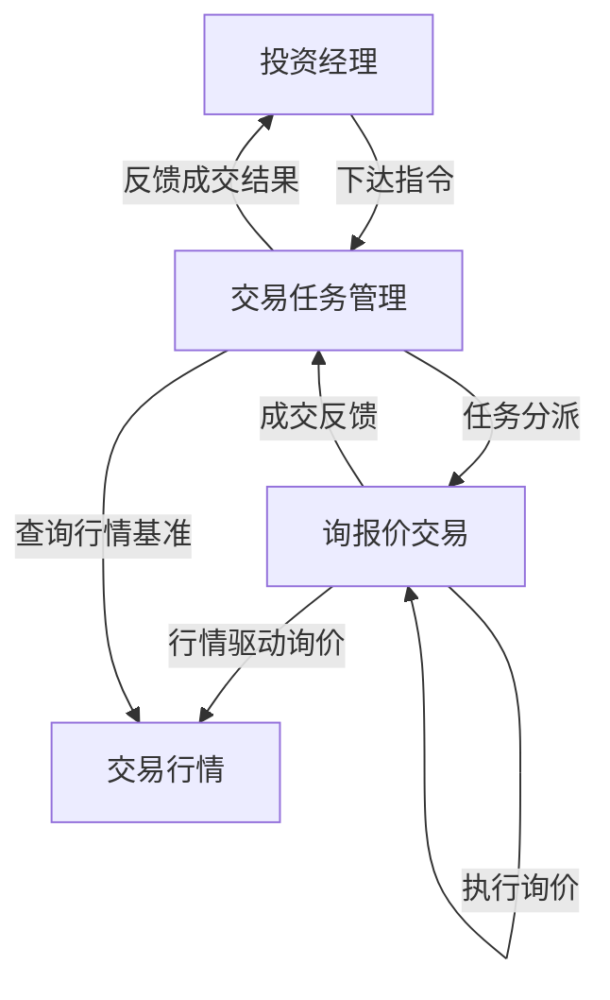

# 03 - 交易中台架构

> 最后更新：2026-04-01

## 中台定位

银行间债券交易中台是衔接"前台终端（行情/工作台）"与"后台系统（投资交易/结算）"的业务枢纽。它为前台产品提供统一的交易能力支撑，包括任务调度、询报价执行、行情汇聚三大核心能力。

## 核心用户与中台的关系

| 用户   | 与中台的交互方式                   | 核心诉求                 |
| ---- | -------------------------- | -------------------- |
| 投资经理 | 通过前台终端下达指令 → 中台负责任务调度与状态跟踪 | 指令表达准确、执行进度可见、成交反馈及时 |
| 交易员  | 通过工作台承接任务 → 中台提供询报价执行与行情支撑 | 询价效率高、成交路径优、留痕完整     |
| 合规人员 | 通过中台公共服务层获取合规检查与留痕数据       | 交易链路可追溯、合规规则前置执行     |

## 三大核心模块

### 模块一：交易任务管理

> 承接投资经理的交易意图，驱动交易员执行，形成"指令→执行→成交→反馈"的完整闭环。

**核心能力**：

- 指令生命周期管理（创建/修改/撤销/过期）
- 任务分派与调度（手动/自动/策略触发）
- 执行状态实时跟踪与里程碑管理
- 成交反馈自动回传与组合影响计算
- 任务优先级与紧迫度排序

详见 [交易任务管理](./交易任务管理.md)

### 模块二：询报价交易

> 覆盖银行间债券市场主流交易达成路径，支持交易员直接交易、通过货币经纪商交易、X-Bond匿名交易三种模式。

**五条交易路径**：

- **直接交易**：交易员通过IM(QTrade/iDeal)直接与对手方询价 → CFETS对话报价成交
- **做市商交易**：做市商发布双边报价，交易员点击成交
- **经纪商交易**：通过货币经纪商（国利/国际/平安利顺等）撮合成交
- **X-Bond交易**：通过CFETS X-Bond电子平台匿名撮合成交（现券买卖）
- **X-Repo交易**：通过CFETS X-Repo平台匿名撮合成交（质押式回购）

详见 [询报价交易](./询报价交易.md)

### 模块三：交易行情

> 汇聚多源行情数据，形成统一行情视图，为交易决策和询报价提供价格基准。

**六类行情来源**：

- **私域行情**：IM聊天中的报价意向经NLP解析后的内部行情
- **做市商行情**：做市商在CFETS上发布的双边报价（Bid/Ask）
- **CFETS行情**：CFETS成交行情、最优报价等公共市场数据
- **经纪商行情**：货币经纪商提供的市场报价与成交信息
- **X-Bond行情**：X-Bond电子平台的匿名报价与成交数据
- **X-Repo行情**：X-Repo平台的回购利率与成交数据

详见 [交易行情](./交易行情.md)

## 模块间协作关系

**关键协作场景**：

| 场景         | 触发模块           | 协作模块           | 数据流向          |
| ---------- | -------------- | -------------- | ------------- |
| 指令驱动的直接交易  | 交易任务管理 → 询报价交易 | 交易行情提供价格基准     | 任务→询价→成交→反馈   |
| 做市商点击成交    | 询报价交易          | 交易行情展示做市商双边报价  | 行情→点击成交→任务关联  |
| 经纪商撮合交易    | 交易任务管理 → 询报价交易 | 交易行情提供经纪商报价    | 任务→经纪商→成交→反馈  |
| X-Bond匿名成交 | 询报价交易          | 交易行情展示X-Bond深度 | 行情→下单→成交→任务关联 |
| X-Repo质押回购 | 询报价交易          | 交易行情展示回购利率     | 行情→下单→成交→任务关联 |

## 文档索引

| 文档                    | 说明                       |
| --------------------- | ------------------------ |
| [交易任务管理](./交易任务管理.md) | 指令生命周期、任务分派、执行跟踪、成交反馈    |
| [询报价交易](./询报价交易.md)   | 直接交易、做市商交易、经纪商交易、X-Bond交易、X-Repo交易五条路径 |
| [交易行情](./交易行情.md)     | 私域行情、做市商行情、公有行情、经纪商行情、X-Bond行情、X-Repo行情 |

## 设计原则

1. **中台不碰界面**：中台只提供业务能力和API，不直接渲染UI
2. **任务驱动一切**：所有交易动作都应有任务上下文，确保可追溯
3. **行情先行**：交易执行前必须有行情基准，避免盲目成交
4. **多路径可切换**：同一任务可灵活选择直接/做市商/经纪商/X-Bond/X-Repo路径执行
5. **留痕贯穿全链路**：从指令下达到成交反馈，每一步都需记录时间和操作人
6. **合规前置**：合规检查嵌入指令下达和成交环节，不依赖事后补录

