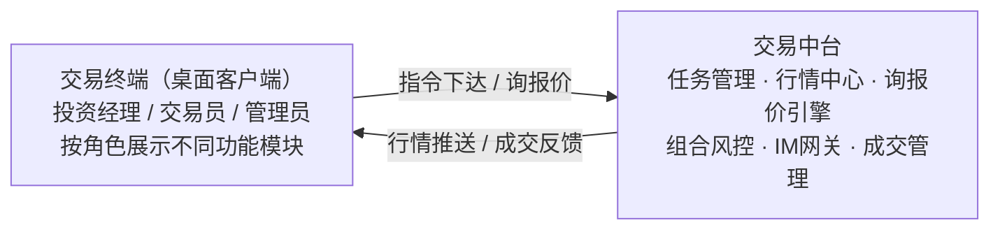
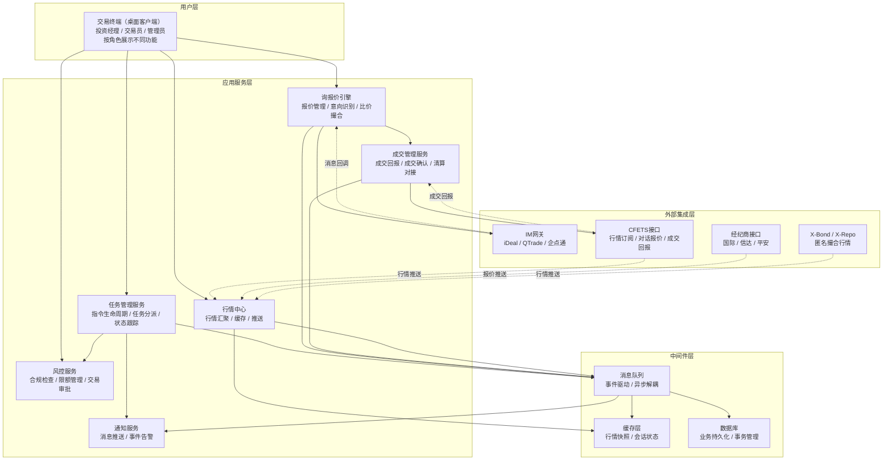
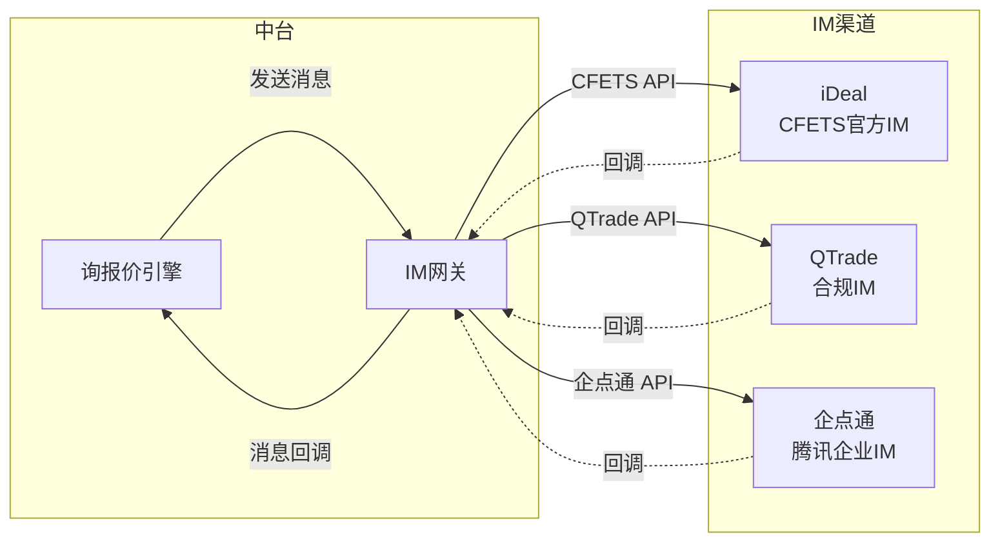
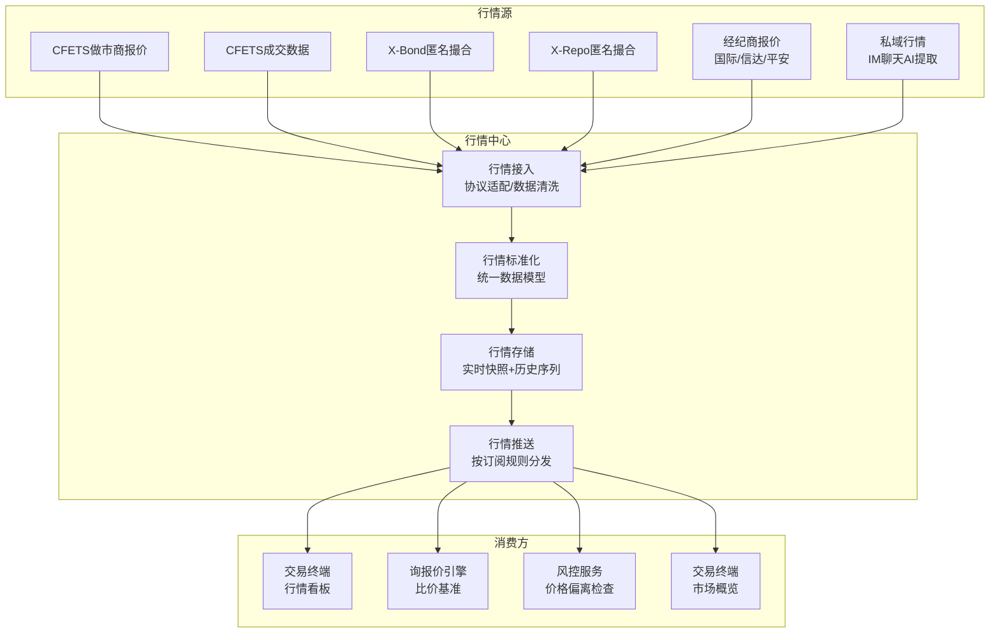
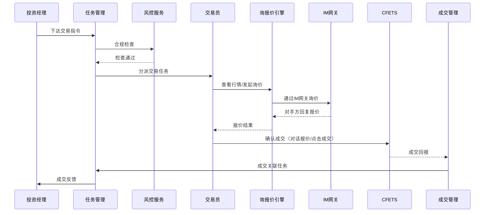
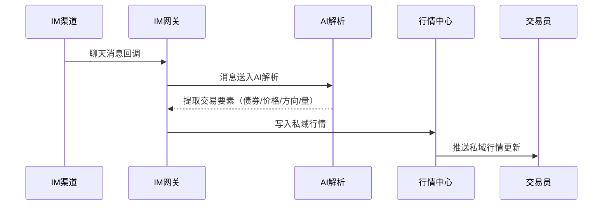
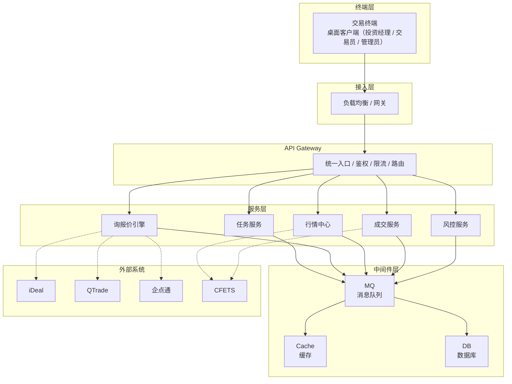

# 系统架构

> 最后更新：2026-04-02

## 一、系统定位

银行间债券交易中台——连接投资决策与交易执行的枢纽，整合多源行情、IM询价、交易任务管理与CFETS交易执行，为投资经理和交易员提供一站式询报价协作平台。

## 二、系统全景架构

## 三、分层架构说明

### 3.1 用户层

统一桌面客户端，登录后根据角色权限展示不同功能模块。

| 角色   | 功能模块                               |
| ---- | ---------------------------------- |
| 投资经理 | 指令下达/撤销、任务执行进度、成交反馈、组合持仓、行情查看      |
| 交易员  | 任务接收、IM询价、RFQ/对话报价、成交录入、行情监控、对手方管理 |
| 管理员  | 用户权限、系统配置、审批流程、审计日志                |

### 3.2 应用服务层

#### 3.2.1 任务管理服务

连接投资经理与交易员的调度中枢。

| 能力   | 说明                  |
| ---- | ------------------- |
| 指令管理 | 投资经理下达/修改/撤销指令，合规审核 |
| 任务分派 | 指定分派、自动分派、抢单、拆单     |
| 状态跟踪 | 指令→任务→成交全链路状态机      |
| 成交反馈 | 成交结果回传投资经理，关联指令核销   |

#### 3.2.2 询报价引擎

中台的核心业务引擎，整合IM沟通与报价管理。

| 能力    | 说明                      |
| ----- | ----------------------- |
| 报价管理  | 做市商双边报价聚合、私域意向报价管理      |
| 意向识别  | 从IM聊天中AI提取债券代码/价格/数量/方向 |
| 比价分析  | 多对手报价对比，辅助交易员选择合适成交     |
| RFQ管理 | CFETS请求报价的发起与应答管理       |
| 报价机器人 | 自动应答、自动询价策略（可扩展）        |

#### 3.2.3 行情中心

多源行情的汇聚与分发。

| 能力       | 说明                |
| -------- | ----------------- |
| 做市商行情    | CFETS做市商双边报价实时订阅  |
| 成交行情     | 银行间市场实时成交数据       |
| X-Bond行情 | 匿名撮合行情            |
| X-Repo行情 | 质押式回购匿名撮合行情       |
| 经纪商行情    | 货币经纪商报价（国际/信达/平安） |
| 私域行情     | IM聊天中提取的非公开报价意向   |
| 行情推送     | 按订阅规则向终端推送行情变动    |

#### 3.2.4 成交管理服务

| 能力   | 说明                 |
| ---- | ------------------ |
| 成交回报 | 接收CFETS成交通知，解析成交要素 |
| 成交确认 | 成交单核对、确认书生成        |
| 成交关联 | 成交与任务/指令的关联与核销     |
| 清算对接 | 成交数据推送至后台结算/估值系统   |

#### 3.2.5 风控服务

| 能力     | 说明                 |
| ------ | ------------------ |
| 交易前合规  | 指令下达时检查投资范围、额度、集中度 |
| 限额管理   | 组合/机构/券种维度的交易限额控制  |
| 审批流程   | 大额/特殊交易的审批链路       |
| 风控规则引擎 | 可配置的风控规则与阈值        |

#### 3.2.6 通知服务

| 能力   | 说明            |
| ---- | ------------- |
| 任务通知 | 新任务分派、状态变更推送  |
| 行情告警 | 报价变动、价格突破阈值告警 |
| 成交通知 | 成交回报实时推送      |
| 系统告警 | 系统异常、接口断连告警   |

### 3.3 中间件层

| 组件   | 用途                         |
| ---- | -------------------------- |
| 消息队列 | 事件驱动架构，行情推送、成交回报、任务变更等异步解耦 |
| 缓存层  | 行情快照缓存、IM会话状态、热点数据加速       |
| 数据库  | 指令/任务/成交/报价等业务数据持久化        |

### 3.4 外部集成层

| 接口            | 方向 | 说明                       |
| ------------- | -- | ------------------------ |
| CFETS         | 双向 | 行情订阅、对话报价、请求报价、点击成交、成交回报 |
| iDeal         | 双向 | 消息收发、聊天记录同步、交易指令对接       |
| QTrade        | 双向 | 消息收发、AI台账数据、意向指令对接       |
| 企点通           | 双向 | 消息收发、企业IM集成              |
| 经纪商           | 入  | 经纪商报价推送（国际/信达/平安）        |
| X-Bond/X-Repo | 双向 | 匿名撮合行情查询与交易              |

## 四、IM网关设计

IM网关是中台与外部IM系统的统一接入层，屏蔽不同IM协议差异。

### 统一消息模型

| 字段           | 类型       | 说明                         |
| ------------ | -------- | -------------------------- |
| msg\_id      | string   | 消息唯一ID                     |
| channel      | enum     | 来源渠道（ideal / qtrade / qyd） |
| sender\_id   | string   | 发送者ID                      |
| sender\_name | string   | 发送者名称                      |
| receiver\_id | string   | 接收者ID                      |
| content      | string   | 消息原文                       |
| timestamp    | datetime | 消息时间                       |
| msg\_type    | enum     | 消息类型（text / image / file）  |
| parsed       | object   | AI解析结果（可选）                 |

### 核心职责

| 职责     | 说明                         |
| ------ | -------------------------- |
| 协议适配   | 统一封装iDeal/QTrade/企点通的API差异 |
| 消息路由   | 根据规则将消息分发到对应的业务处理逻辑        |
| 会话管理   | 维护IM会话状态与上下文               |
| 消息持久化  | 聊天记录存储，支持回溯与合规审计           |
| AI解析触发 | 将聊天消息送入NLP引擎，提取交易要素        |

## 五、行情中心设计

### 统一行情数据模型

| 字段           | 类型       | 说明                                             |
| ------------ | -------- | ---------------------------------------------- |
| source       | enum     | 行情来源（cfets / xbond / xrepo / broker / private） |
| bond\_code   | string   | 债券代码                                           |
| bond\_name   | string   | 债券名称                                           |
| bid\_price   | decimal  | 买入价/收益率                                        |
| ask\_price   | decimal  | 卖出价/收益率                                        |
| bid\_vol     | int      | 买入量（万元）                                        |
| ask\_vol     | int      | 卖出量（万元）                                        |
| counterparty | string   | 报价方/对手方                                        |
| timestamp    | datetime | 行情时间                                           |
| validity     | string   | 有效期                                            |

## 六、核心数据流

### 6.1 交易指令执行流

### 6.2 私域行情提取流

## 七、部署架构

## 八、模块索引

| 文档                             | 说明             |
| ------------------------------ | -------------- |
| [交易流程](../02-业务流程/交易流程.md)     | 交易全流程业务描述      |
| [交易行情](../02-业务流程/交易行情.md)     | 六类行情来源详细设计     |
| [交易任务管理](../02-业务流程/交易任务管理.md) | 指令/任务/成交反馈详细设计 |

