# 询报价交易

> 最后更新：2026-04-01

## 一、模块定位

询报价交易是中台的核心执行引擎，负责支撑银行间债券市场的全部交易达成路径。它为交易员提供五种交易模式：直接交易、做市商交易、经纪商交易、X-Bond交易和X-Repo交易，覆盖从询价到成交的全流程。

| 交易路径 | 交易机制 | 匿名性 | 适用场景 |
|---------|---------|--------|---------|
| 直接交易 | 一对一询价谈判 | 双方已知 | 大额、非标券、需要谈判 |
| 做市商交易 | 点击成交做市商双边报价 | 双方已知 | 标准券、快速成交 |
| 经纪商交易 | 经纪商居间撮合 | 匿名 | 大额、不想暴露身份 |
| X-Bond交易 | 电子匿名撮合 | 完全匿名 | 现券买卖、流动性好的利率债 |
| X-Repo交易 | 电子匿名撮合 | 完全匿名 | 质押式回购、资金交易 |

## 二、五条交易路径

### 2.1 路径一：直接交易

> 交易员通过IM工具（QTrade/iDeal）直接与对手方询价，达成意向后在CFETS通过对话报价完成成交。

**业务流程**：

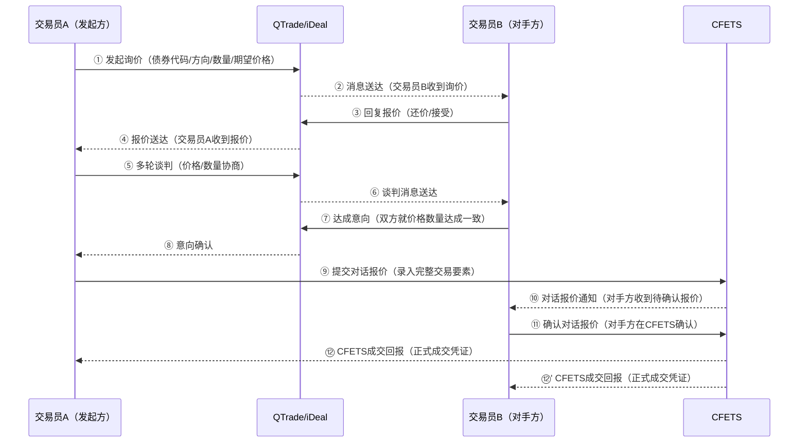

**核心功能**：
- **IM消息接入**：对接QTrade/iDeal，获取交易聊天记录
- **AI语义识别**：从非结构化聊天中提取交易要素
- **交易意向管理**：结构化存储询价过程中的报价和意向
- **CFETS对话报价**：支持手动或API方式录入成交
- **成交回报关联**：将CFETS成交单与IM聊天记录关联

**技术实现**：
- 对接QTrade/iDeal的消息回调接口
- 部署NLP模型进行语义识别
- 建立交易意向与CFETS成交单的关联映射

### 2.2 路径二：做市商交易

> 做市商在CFETS上持续发布双边报价（Bid/Ask），交易员可直接点击做市商报价完成成交，无需谈判。

**业务流程**：

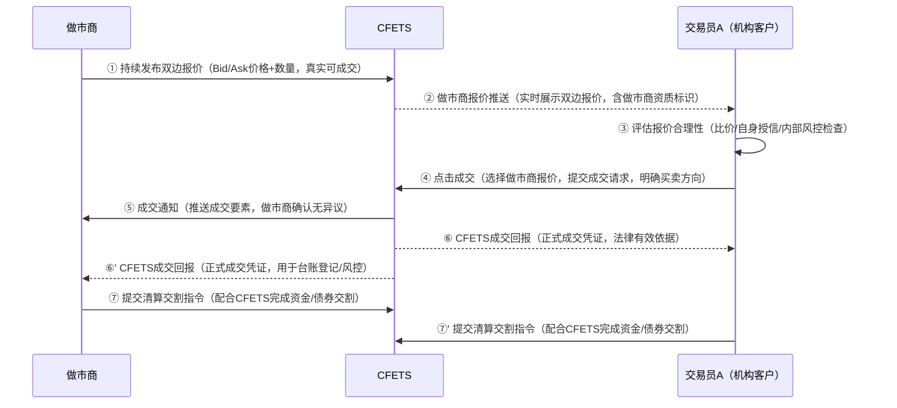

**核心功能**：
- **做市商报价展示**：实时展示做市商双边报价（Bid/Ask）
- **报价筛选**：按债券代码、做市商、价差等条件筛选最优报价
- **一键成交**：点击做市商报价即可提交成交请求
- **做市商评价**：统计做市商的报价质量、响应速度、成交量

**技术实现**：
- 订阅CFETS做市商报价数据（通过交易行情模块）
- 对接CFETS点击成交接口
- 建立做市商报价质量评估体系

### 2.3 路径三：经纪商交易

> 通过货币经纪商（如国利、国际、平安利顺等）撮合成交，利用经纪商的市场网络和撮合能力。交易双方互不知晓对方身份。

**业务流程**：
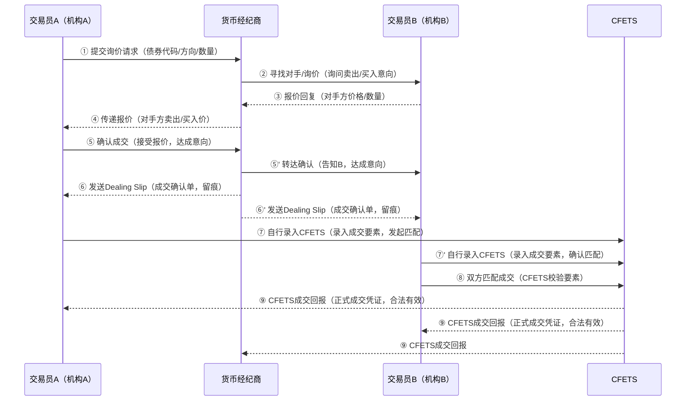
**核心功能**：
- **经纪商接口管理**：对接多家经纪商的报价和成交接口
- **询价管理**：向经纪商批量提交询价请求
- **报价聚合**：汇总多家经纪商的报价进行比价
- **成交协调**：通过经纪商完成交易撮合
- **佣金管理**：记录和核算经纪商佣金

**技术实现**：
- 对接经纪商的标准API接口
- 建立经纪商报价的实时聚合与比价系统
- 与CFETS系统的成交回传集成

### 2.4 路径四：X-Bond交易

> 通过CFETS X-Bond电子平台进行匿名撮合成交，适合标准化、流动性较好的现券买卖。

**业务流程**：

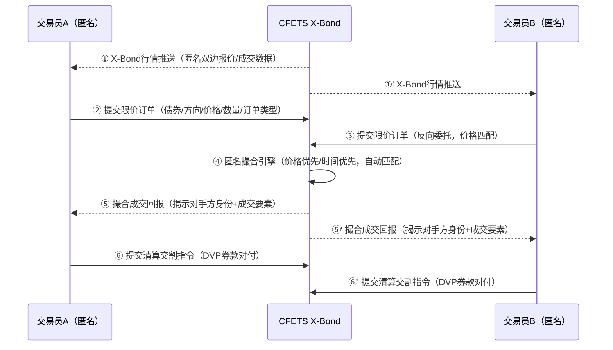

**核心功能**：
- **X-Bond行情订阅**：实时获取X-Bond平台的匿名报价和成交数据
- **订单管理**：支持限价、市价、FOK、IOC等多种订单类型
- **成交撮合**：参与X-Bond平台的自动撮合成交
- **对手方揭示**：成交后获取对手方信息
- **成交报告**：生成X-Bond成交报告

**技术实现**：
- 对接CFETS X-Bond接口
- 实现订单生命周期管理
- 与交易任务管理模块的状态同步

### 2.5 路径五：X-Repo交易

> 通过CFETS X-Repo电子平台进行质押式回购的匿名撮合成交，专门针对回购交易设计，支持自动选券和质押率管理。

**业务流程**：

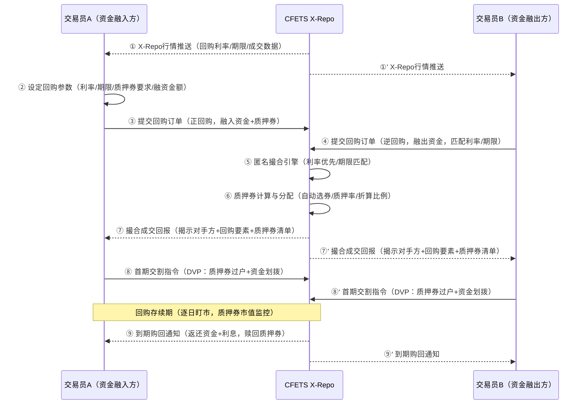

**核心功能**：
- **X-Repo行情订阅**：实时获取X-Repo平台的回购利率和成交数据
- **回购参数管理**：设定回购利率、期限、质押券要求
- **质押券管理**：自动选券、质押率计算、折算比例管理
- **订单管理**：支持限价、市价等多种订单类型
- **首期/到期处理**：管理回购的首期交割和到期购回

**技术实现**：
- 对接CFETS X-Repo接口
- 集成质押券估值与质押率计算引擎
- 实现回购生命周期管理（首期→存续→到期）

## 三、交易执行状态机

### 3.1 CFETS交互全景

> 所有交易路径最终都需经过CFETS（中国外汇交易中心暨全国银行间同业拆借中心）完成成交确认。CFETS是银行间债券市场的法定交易平台，成交回报是交易达成的法定依据。

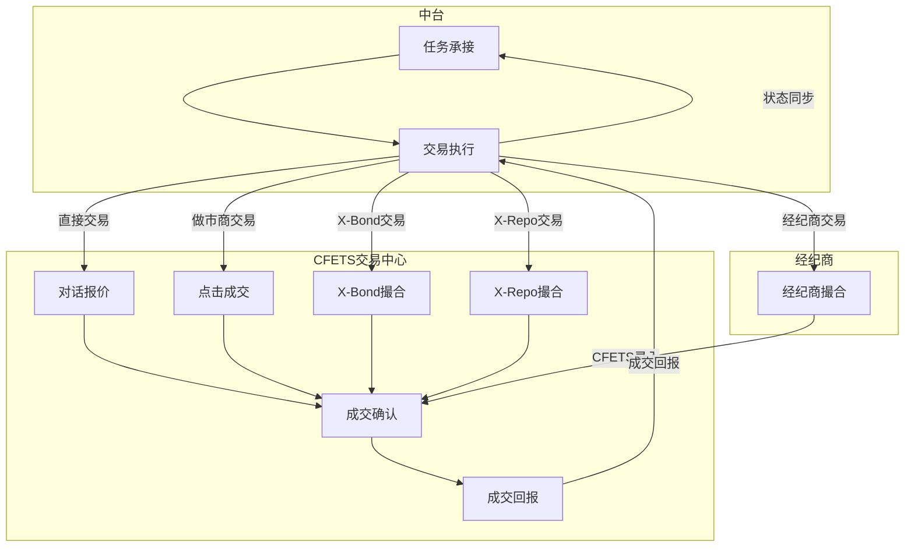

### 3.2 直接交易状态机

> 双方在IM上谈判达成意向后，一方在CFETS提交对话报价，对手方在CFETS上确认或拒绝。

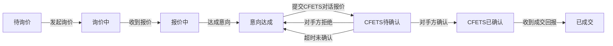

### 3.3 经纪商交易状态机

> 通过经纪商居间撮合，经纪商确认成交后代为在CFETS录入，双方无需互相确认。

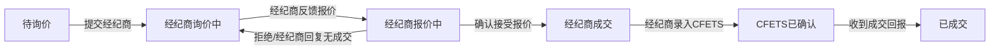

### 3.4 电子交易状态机（做市商/X-Bond/X-Repo）

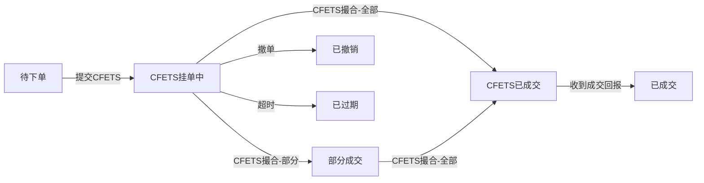

### 3.5 状态说明

**直接交易状态**：

| 状态 | 说明 | CFETS交互 |
|------|------|----------|
| 待询价 | 任务已分派，交易员准备开始询价 | — |
| 询价中 | 交易员通过IM与对手方接触询价 | — |
| 报价中 | 收到对手方报价，正在谈判 | — |
| 意向达成 | 双方在IM上就价格数量达成一致 | — |
| CFETS待确认 | 已在CFETS提交对话报价，等待对手方确认 | 对话报价已提交 |
| CFETS已确认 | 对手方在CFETS确认了对话报价 | 对话报价已确认 |
| 已成交 | 收到CFETS成交回报，交易正式达成 | 收到成交回报 |

**经纪商交易状态**：

| 状态 | 说明 | CFETS交互 |
|------|------|----------|
| 待询价 | 任务已分派，交易员准备向经纪商询价 | — |
| 经纪商询价中 | 已向经纪商提交询价请求，等待反馈 | — |
| 经纪商报价中 | 经纪商反馈了报价，交易员评估中 | — |
| 经纪商成交 | 交易员确认接受经纪商报价，经纪商撮合成功 | — |
| CFETS已确认 | 经纪商代为在CFETS录入成交 | 成交已录入CFETS |
| 已成交 | 收到CFETS成交回报，交易正式达成 | 收到成交回报 |

**电子交易状态**：

| 状态 | 说明 | CFETS交互 |
|------|------|----------|
| 待下单 | 任务已分派，交易员准备下单 | — |
| CFETS挂单中 | 订单已提交到CFETS电子平台等待撮合 | 订单已提交CFETS |
| 部分成交 | CFETS已部分撮合成交 | 收到部分成交回报 |
| CFETS已成交 | CFETS已全部撮合成交 | 撮合完成 |
| 已成交 | 收到CFETS成交回报，交易正式达成 | 收到成交回报 |
| 已撤销 | 交易员向CFETS撤单成功 | 撤单请求成功 |
| 已过期 | 订单在CFETS超过有效期未成交 | 订单有效期截止 |

## 四、对手方管理

### 4.1 对手方画像

| 属性 | 说明 | 示例 |
|------|------|------|
| 对手方ID | 唯一标识 | CP-001 |
| 机构名称 | 对手方全称 | XX银行股份有限公司 |
| 机构类型 | 银行/券商/基金/保险等 | 银行 |
| 授信额度 | 可用交易额度 | 10亿 |
| 交易偏好 | 偏好券种、期限、规模 | 利率债、3-5年期 |
| 活跃度 | 历史交易频率 | 高 |
| 信用等级 | 内部评级 | AAA |
| 是否做市商 | 是否具有做市商资格 | 是 |
| 联系方式 | 交易员姓名、IM账号 | 张三，zhang.san@qtrade |

### 4.2 对手方筛选策略

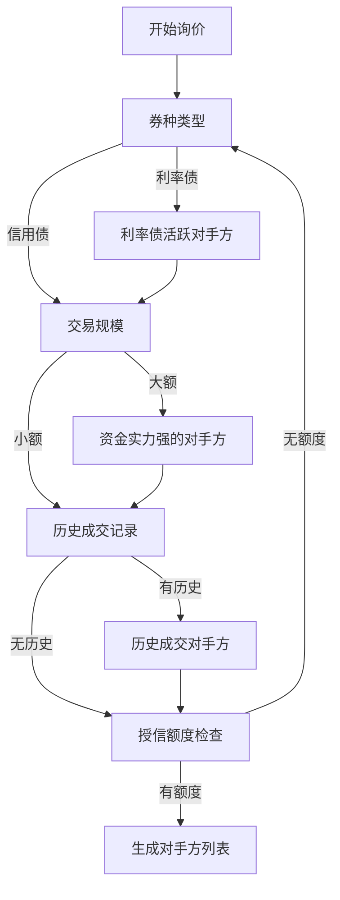

### 4.3 对手方评级

| 评级 | 标准 | 交易策略 |
|------|------|---------|
| A+ | 信用AAA、授信充足、交易活跃、报价合理 | 优先选择，可做大额交易 |
| A | 信用AA+、授信充足、交易较活跃 | 常规选择，控制交易规模 |
| B | 信用AA、授信有限、交易偶发 | 谨慎选择，小额尝试 |
| C | 信用低于AA、授信不足、交易稀少 | 避免选择，或仅做小额隔夜 |

## 五、询价管理

### 5.1 询价模板

| 模板类型 | 适用场景 | 内容示例 |
|---------|---------|---------|
| 标准询价 | 常规交易 | "21国开10 买入 5000万 收益率2.80%左右" |
| 批量询价 | 多个券种 | "21国开10/21国债03 买入 各3000万 收益率2.80%/2.75%" |
| 试探性询价 | 市场摸底 | "21国开10 意向买入 1亿 收益率区间2.75%-2.85%" |
| 紧急询价 | 止损/限时 | "21国开10 卖出 5000万 立即 收益率2.90%以下" |

### 5.2 询价策略

| 策略 | 说明 | 适用场景 |
|------|------|---------|
| 单点询价 | 只向单个对手方询价 | 特定关系、特定券种 |
| 多点并行 | 同时向多个对手方询价 | 市场深度不足、价格不透明 |
| 阶梯询价 | 按价格阶梯逐步询价 | 大额交易、价格敏感 |
| 定向询价 | 针对特定做市商询价 | 活跃券、标准化产品 |

### 5.3 报价管理

**报价记录**：
- 报价时间、报价方、债券代码、方向、价格、数量、有效期
- 报价状态（有效/过期/撤回）
- 报价来源（IM/做市商/经纪商/X-Bond/X-Repo）

**比价逻辑**：
- 按价格优劣排序
- 考虑对手方信用和历史成交记录
- 结合市场行情基准进行评估

## 六、成交管理

### 6.1 成交要素

| 要素 | 说明 | 示例 |
|------|------|------|
| 成交ID | 系统唯一标识 | DEAL-20260401-001 |
| 债券代码 | 交易标的 | 210210.IB |
| 交易方向 | 买入/卖出 | BUY |
| 成交价格 | 实际成交收益率 | 2.82% |
| 成交数量 | 实际成交面值（万元） | 5000 |
| 对手方 | 交易对手 | XX银行 |
| 成交时间 | CFETS确认时间 | 2026-04-01 09:45:00 |
| 成交路径 | 直接/做市商/经纪商/X-Bond/X-Repo | 直接交易 |
| 交易员 | 执行交易员 | Trader-李四 |
| 关联任务 | 来源任务ID | TASK-20260401-001 |

### 6.2 成交确认流程

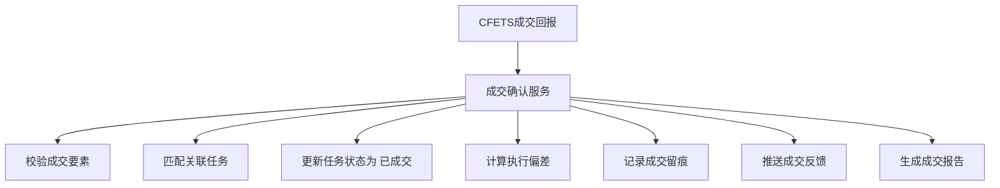

### 6.3 异常成交处理

| 异常类型 | 处理策略 |
|---------|---------|
| 价格异常 | 标记为偏离成交，触发合规审核 |
| 数量不符 | 按实际成交数量更新，剩余数量继续执行 |
| 对手方违约 | 状态回退至询价中，重新寻找对手 |
| 系统故障 | 保留本地成交记录，故障恢复后同步 |

## 七、与其他模块的接口

### 7.1 对外提供的接口

| 接口 | 消费方 | 说明 |
|------|--------|------|
| 发起询价 | 前台终端（交易员） | 交易员开始询价 |
| 查询报价 | 前台终端 | 查看收到的报价 |
| 点击成交 | 前台终端 | 做市商报价点击成交 |
| 提交订单 | 前台终端 | X-Bond/X-Repo下单 |
| 确认成交 | 前台终端 | 交易员确认成交 |
| 更新任务状态 | 交易任务管理模块 | 执行进度回调 |
| 成交反馈 | 交易任务管理模块 | 成交结果回传 |
| 询价统计 | 前台终端 | 询价效率与成功率统计 |

### 7.2 依赖的外部接口

| 接口 | 提供方 | 说明 |
|------|--------|------|
| 行情基准 | 交易行情模块 | 询价前的价格参考 |
| 做市商报价 | 交易行情模块 | 做市商双边报价数据 |
| 对手方授信 | 中台公共服务层 | 交易前的额度检查 |
| CFETS对话报价接口 | CFETS | 直接交易成交录入 |
| CFETS点击成交接口 | CFETS | 做市商报价点击成交 |
| CFETS X-Bond接口 | CFETS | 现券匿名撮合成交 |
| CFETS X-Repo接口 | CFETS | 回购匿名撮合成交 |
| 经纪商接口 | 货币经纪商 | 报价获取、成交协调 |
| IM消息接口 | QTrade/iDeal | 直接询价沟通 |
